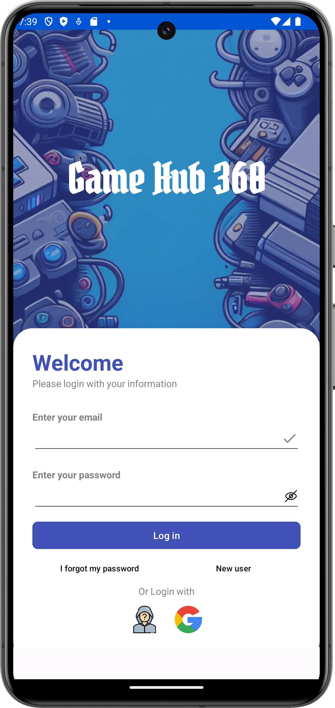
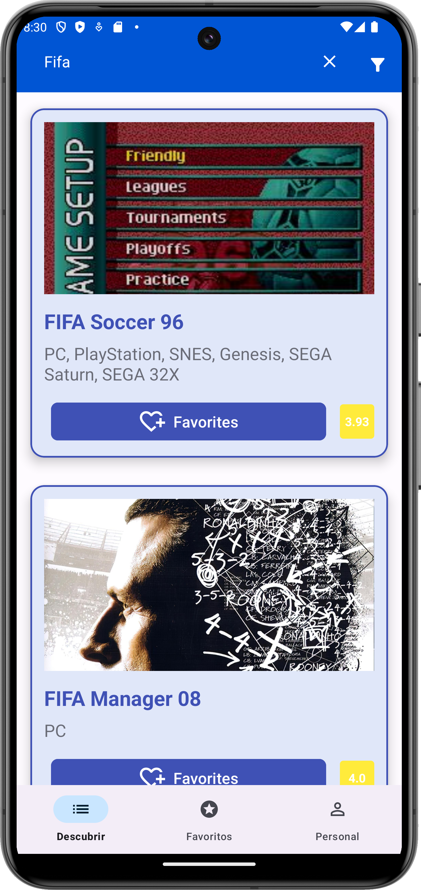
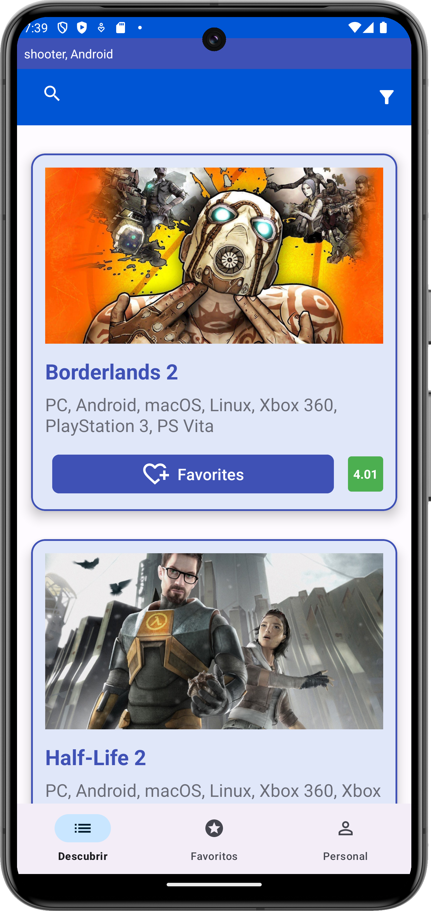
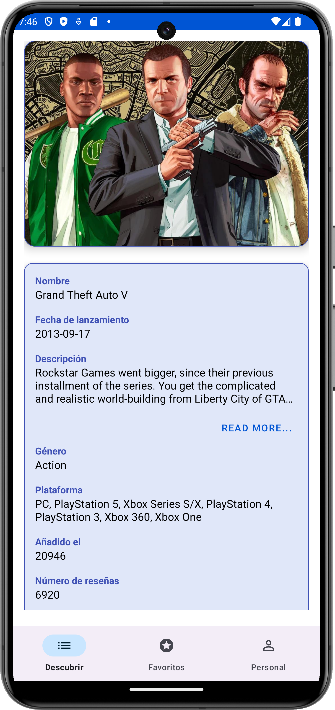
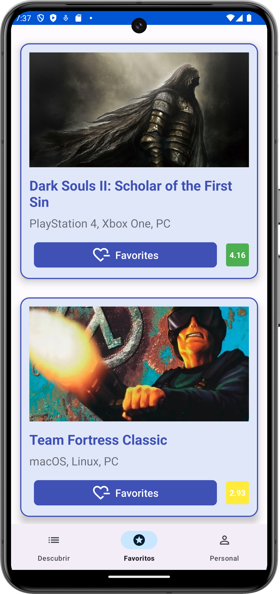
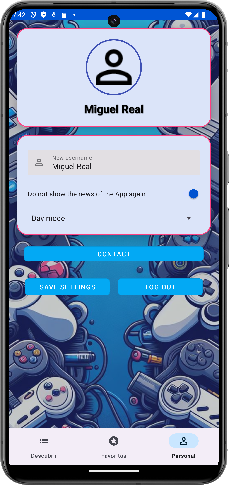

# 🎮 GameHub360 🎮

## 🌟 Bienvenido a GameHub360 🌟

GameHub360 es tu plataforma definitiva para explorar, gestionar y compartir videojuegos. Este proyecto ha sido desarrollado individualmente como proyecto final del grado superior de Desarrollo de Aplicaciones Multiplataforma.

---

## 🚀 Características Principales

1. **🕹 Exploración Completa de Videojuegos**: Accede a una amplia biblioteca de juegos con detalles completos.
2. **🔒 Inicio de Sesión Seguro**: Utiliza Firebase Authentication para un inicio de sesión seguro y confiable.
3. **🎛 Gestión Personalizada**: Personaliza y gestiona tus videojuegos favoritos.
4. **🔍 Buscador Avanzado**: Encuentra fácilmente juegos por nombre, género y otros criterios relevantes.
5. **🎨 Opciones de Personalización**: Adapta la experiencia a tus preferencias individuales.
6. **👤 Inicio de Sesión Anónimo**: Guarda datos localmente con la opción de inicio de sesión anónimo.
7. **🗂 Filtros de Juegos**: Filtra juegos por categorías, plataformas y más.

---

## 📲 Tecnologías Utilizadas

- **Firebase**: Para autenticación, almacenamiento en la nube y bases de datos en tiempo real.
- **Room Database**: Para almacenamiento local de datos.
- **RAWG.IO API**: Para obtener datos detallados sobre videojuegos.
- **Data Store**: Para gestionar preferencias del usuario.

---

## 📚 Documentación

### 📐 Arquitectura

- **MVVM (Model-View-ViewModel)**: Estructura que separa la lógica de negocio de la interfaz de usuario para una mejor gestión del código y mantenimiento.

### 🔥 Firebase

- **Authentication**: Soporte para correo y Google, además de inicio de sesión anónimo.
- **Storage**: Almacenamiento seguro de archivos en la nube.
- **Firestore y Realtime Database**: Sincronización en tiempo real de datos.

### 🗄 Bases de Datos Locales

- **Room**: Manejo eficiente de datos sin conexión.
- **Data Store**: Almacenamiento seguro de preferencias del usuario.

---

#### Capturas de Pantalla

Aquí puedes disfrutar de algunas capturas de pantalla de la aplicación GameHub360:

<div style="display:flex;justify-content:center;align-items:center;">
    
    
    

</div>

<div style="display:flex;justify-content:center;align-items:center;margin-top:10px;">
    
    
    
</div>

## 👨‍💻 Instalación y Configuración

1. **Instala el APK**:
   ```bash
   GameHub360.apk
   ```

---

## 📬 Contacto

Si deseas obtener el código del proyecto, por favor, ponte en contacto con el desarrollador en el correo: [mreal76760@gmail.com](mailto:mreal76760@gmail.com)

---


---

Gracias por visitar GameHub360!! Disfruta de la experiencia y no dudes en contactarnos para cualquier consulta o sugerencia.
